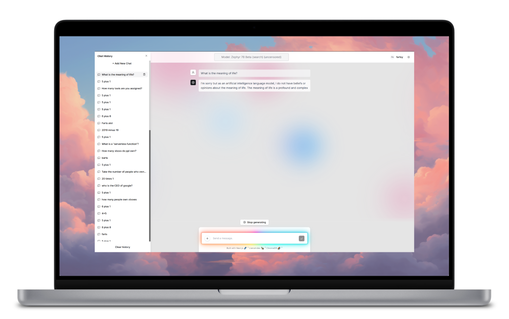
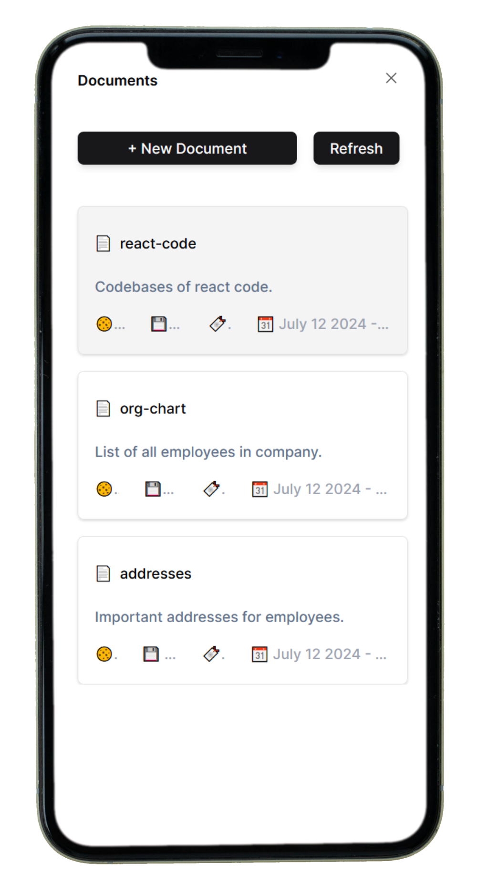

<h1 align="center">Obrew Studio: WebUI</h1>

<h3 align="center">
  
  <br>
  <br>
    A tool for building custom agents and workflows. Built to support low-code Ai app development at no cost.
  <br>
  <br>
  
  
  

</h3>

## Introduction

The goal of this project are:

1. Allow anyone to install and run open-source LLM's on hardware they own
2. Provide "batteries included" building blocks (RAG, models, UI, server, memory, etc) for Ai Engineers
3. Support fast and cheap development on commodity hardware

## How It Works



Obrew Studio can be used via the API or the WebUI. Both methods are used to talk to Obrew Server, which is what performs all the Ai workloads. To start using Obrew Studio, download the latest installer from [releases](https://github.com/dieharders/obrew-studio-server/releases) and install the app.

<br clear="left"/>

## Features Roadmap



✅ Run open source models locally for free<br>
✅ Explore and download models from HuggingFace<br>
✅ Build custom bots (like GPT store)<br>
✅ Streaming chat UI<br>
✅ Chat with your documents (RAG)<br>
✅ Inspect & optimize document chunking for RAG<br>
✅ Data retrieval (scrape website, file, raw text)<br>
✅ Save chat history<br>
✅ Build agents with access to tools<br>
❌ Create and execute jobs<br>
❌ Display source citations in chat<br>
❌ Curated lists of models, templates, tools, cloud saves<br>

<br clear="right"/>

## How to Run

Install dependencies:

```bash
pnpm i
```

Start a local development server with hot-reloading:

```bash
pnpm dev
```

## How to Deploy

To production:

```bash
vercel deploy --prod
```

To preview:

```bash
vercel deploy
```

## Release versioning

### Increase the major version by 1 (1.x.x to 2.x.x)

pnpm version major

### Increase the minor version by 1 (x.1.x to x.2.x)

pnpm version minor

### Increase the patch version by 1 (x.x.1 to x.x.2)

pnpm version patch

## Learn More

[OpenBrewAi.com](https://www.openbrewai.com)<br>
[Obrew Studio - Server](https://github.com/dieharders/obrew-studio-server)<br>
[Based on Vercel's chatbot](https://github.com/vercel-labs/ai-chatbot)<br>
